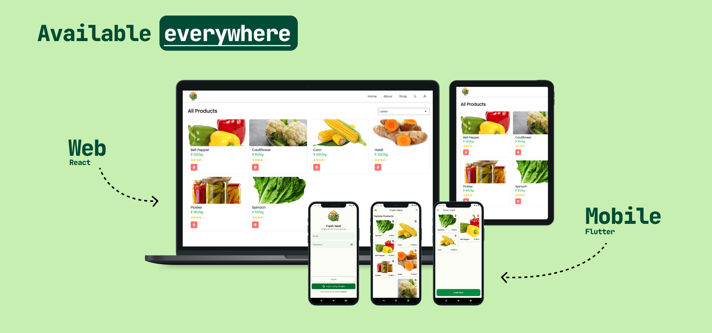
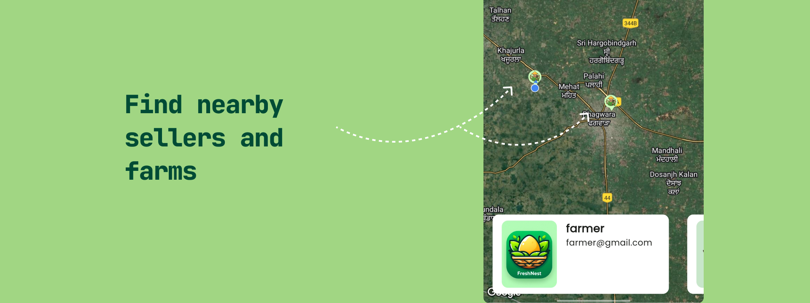

    <h1 align="center">
        <a href="https://fresh-nest.netlify.app">
      FreshNest
        </a>
    </h1>
    <h2 align="center"> ✨Freshness delivered, Farmers empowered✨</h2>

  <a href="https://fresh-nest.netlify.app/">
    </img>
  </a>
  <a href="https://github.com/AmanNegi/FreshNest/releases/tag/v0.0.3">
  </img>
  </a>

 
FreshNest is an online marketplace that connects local vegetable sellers and farmers directly with customers who are seeking <strong>fresh and nutritious produce</strong>. We believe in fostering a direct connection between producers and consumers, empowering local communities, and promoting sustainable farming practices.

With FreshNest, you can explore a wide range of locally grown vegetables, sourced directly from farmers in your area. By eliminating intermediaries, we ensure that you receive the freshest and highest-quality produce while supporting local farmers and their livelihoods.

## Why Choose FreshNest? 🤷‍♂️

- **Support Local Farmers**: By purchasing from FreshNest, you contribute to the growth and prosperity of local farmers. Your support helps them sustain their agricultural practices and ensures a vibrant and resilient local food ecosystem.
- **Wide Variety**: Discover a diverse selection of vegetables from different farms, enabling you to explore new flavors, try unique heirloom varieties, and add excitement to your culinary creations.
- **Shop Local with Confidence**: Effortlessly discover farms and vendors in your area. FreshNest uses your location to connect you with nearby producers, ensuring you get the freshest produce with minimal travel time.
- **See What You're Getting**: Browse captivating images uploaded directly by sellers. Get a clear picture of the farm, and the produce itself, and gain confidence in your purchase before adding it to your cart. FreshNest fosters transparency by allowing you to virtually visit the source of your food.

## How we built it? 🤷

To deliver a user-friendly web interface, the project uses a Node.js & Express.js backend for server-side operations, while the frontend utilizes React & TailwindCSS. A mobile client was developed using Flutter for greater accessibility.

The app has two user types: customers and farmers. Customers can buy products, track orders, and leave feedback. Farmers can list products, manage inventory, and communicate with customers. Admin view is available for content moderation.

#### For Customers:
- View products
- Add items to their cart
- Locate nearby farms on a Map (mobile client only)
- Leave reviews on products
- Search products
- View Farm Details
- & more...

#### For Farmers:
- Add/Manage listings
- Upload images of their farm
- View/Update Profile
- View Reviews and Reply
- & more...

The project is maintained to industry standards, with separate branches for different tasks, comprehensive documentation, and beginner-friendly issues to give newcomers hands-on experience with the frameworks (Flutter/Express/ReactJS). For deployment, we evaluated several platforms and chose [Netlify](https://www.netlify.com) for the website and [Adaptable.io](https://adaptable.io) for the backend.

### Architectural Patterns and Code Organization 📂🗃️

While building FreshNest, we looked through multiple architectural patterns and decided to go with a mutation of MVP, tailoring it to our specific needs. In the repository you'll find frontend code either of Flutter/React divided into application and presentation folders. This aligns with the separation of concerns principle promoted by MVP. Here's what each folder contains:

#### Application Folder:
- Code for fetching data from the backend API.
- Logic for processing and formatting the raw data for use in the presentation layer.
- Any application-specific business logic related to the feature.
#### Presentation Folder:
- Reusable UI components for the overall structure of the feature's interface.
- Components responsible for displaying the formatted data received from the application layer.
- Styling information specific to how the feature is presented visually.

By separating these concerns, the code becomes more maintainable, reusable, and easier to test. It also promotes a clean separation between the data and business logic (application folder) and the visual representation of that data (presentation folder).

### Other Decisions 🐳

#### Enforcing Consistent Code with ESLint 🧹
- We leverage ESLint, a popular code linting tool, to ensure consistent coding style and identify potential errors in the JavaScript codebase (both frontend and backend).
- ESLint helps maintain clean code, reducing bugs and improving readability for everyone working on the project.

#### Documentation 📃
- **Beginner Developer's guide**: Each folder has a `Readme.md` which assists the developers with how to set up the particular project. Check more in [Contributing.md](./Contributing.md).
- **API Documentation with Swagger Autogen**: The backend utilizes the Swagger AutoGen tool to automatically generate API documentation for all endpoints. This readily provides developers with a clear understanding of available functionalities, request parameters, and expected responses.
- **JSDoc Comments for Code Clarity**: Both frontend and backend JavaScript code leverage JSDoc comments. These comments explain the purpose of functions, variables, and classes, enhancing code readability and maintainability. Developers can easily understand the intent and functionality of code segments without needing extensive context.

#### Streamlined Development with Scripts 📜
- The `.vscode/launch.json` file within the project repository stores launch configurations for Visual Studio Code.
- These configurations define scripts to easily run/debug the frontend (React or Flutter) and backend (Node.js/Express.js).
- Newcomers can leverage these launch scripts to quickly start developing. This lowers the barrier to entry and facilitates a smooth development workflow.

## Tech Stack 🛠️

| Technology | Tech Stack                                                                                                           | Version      |
| ---------- | -------------------------------------------------------------------------------------------------------------------- | ------------ |
| Mobile     |       | 3.16.9       |
| Web        |         | 18.2.0       |
| Backend    |               | 20.11.1      |
| Database   |  | mongodbatlas |

## Contributing 🤝

Feel free to refer to our contribution guide at [`CONTRIBUTING.md`](./docs/CONTRIBUTING.md) for more details on how to contribute.

## Contributors 👨‍💻

We would like to extend our heartfelt thanks to all the contributors who have dedicated their time and effort to make FreshNest a better platform. Your contributions are invaluable and have helped us improve our platform. We truly appreciate your hard work and commitment to making FreshNest a success. Thank you for your contributions and for being a part of our community!

## License 🛡️

> We believe the AGPLv3 best supports our commitment to open-source development and fosters a collaborative atmosphere where everyone can contribute and benefit from the project's growth.

Distributed under the AGPLv3 License. See [`LICENSE.md`](./LICENSE) for more information.

We've chosen to license this project under the **GNU Affero General Public License version 3 (AGPLv3)** to promote open-source development and collaboration. Here are the key reasons for this decision:

- **Strong Copyleft**: The AGPLv3 ensures that derivative works (modified versions) of our code also remain open-source. This means anyone who distributes a modified version over a network (like our backend, frontend, or mobile app) must make the corresponding source code available under the same AGPLv3 license. This fosters a collaborative environment and prevents users from creating closed-source derivatives from our open-source work.
- **Open Source for Everyone**: The AGPLv3 guarantees that not only our code but also significant modifications to it, remain open and accessible to everyone. This transparency and collaborative spirit are essential for open-source projects.
- **Network Compatibility**: Since our project involves components that communicate over a network (backend, frontend, mobile client), the AGPLv3 is particularly fitting. It specifically addresses network-based interactions, ensuring that modifications made to these network-facing parts are also open-source.

## Support 🙏

Currently, the best way to support our project is by leaving a ⭐️. Don't forget to leave a star.

