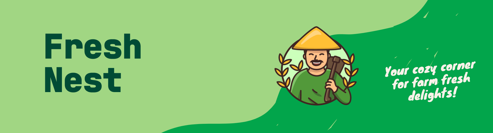
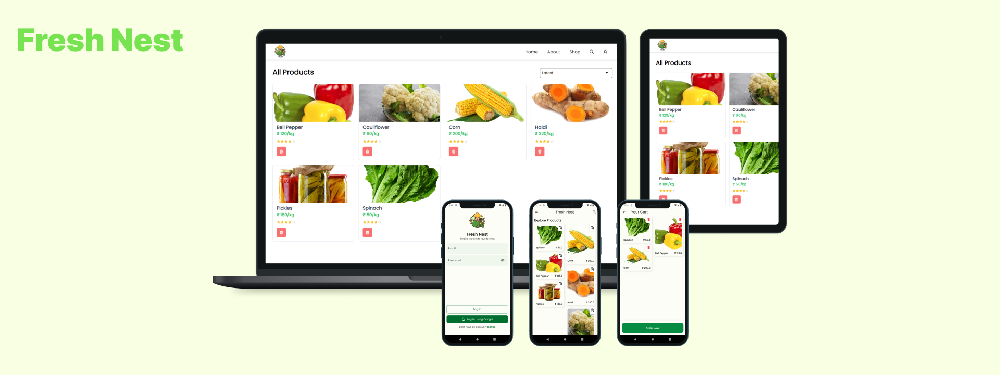

# FreshNest: Educational Full-Stack E-commerce Application

Welcome to FreshNest!

## Introduction
FreshNest is a comprehensive educational full-stack e-commerce application designed to provide a practical learning experience for developers. It serves as an ideal codebase for beginners to gain hands-on experience in building e-commerce applications.

## Key Features
- **Educational Focus:** FreshNest provides a structured platform for developers to understand the intricacies of e-commerce application development in a controlled environment.
- **Learning Environment:** With well-documented code and a beginner-friendly approach, FreshNest offers a conducive environment for honing skills in web and mobile application development.
- **Practice and Experimentation:** Developers can use FreshNest to experiment, practice, and refine their skills in a real-world e-commerce application context.

## Tech Stack
- **Mobile:** Flutter
- **Web:** React
- **Backend:** NodeJS
- **Database:** MongoDB

## Contribution
FreshNest encourages contributions from developers of all levels. If you are interested in contributing or enhancing your skills in e-commerce development, please refer to our [CONTRIBUTING.md](./docs/CONTRIBUTING.md) to get started.

## License
Distributed under the AGPLv3 License. See [`LICENSE.md`](./LICENSE) for more information.

Your support is crucial to us. Don't forget to leave a star if you find FreshNest helpful.

Happy Learning with FreshNest! 🌱🚀
